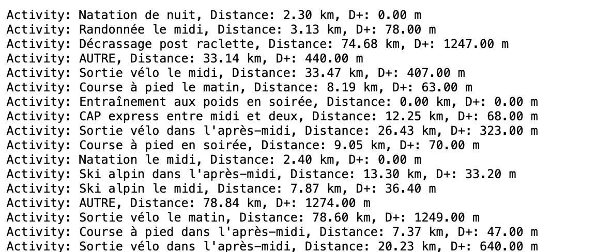

# Strava Doctor

Strava Doctor is a tool designed to help athletes analyze and improve their performance by providing detailed insights and recommendations based on their Strava data.

## Features

- **Data Analysis**: Analyze your Strava activities to identify trends and areas for improvement.
- **Performance Insights**: Get personalized insights and recommendations to enhance your training.
- **Visualization**: Visualize your performance data with interactive charts and graphs.
- **Integration**: Seamlessly integrate with your Strava account to fetch and analyze your activities.

## Installation

To install Strava Doctor, follow these steps:

1. Clone the repository:
    ```bash
    git clone https://github.com/jhayotte/strava-doctor.git
    ```

## Usage

To start using Strava Doctor, follow these steps:

1. Authenticate with your Strava account.
Create your app in https://www.strava.com/settings/api to get a clientID and define the recall address to `localhost:8080` and website `localhost` as long as you run it only in local.

2. Run your product
Run your server `go run main.go`

3. Enable your app
Autorize your app to be connected to Strava`https://www.strava.com/oauth/authorize?client_id={CLIENT_ID}&response_type=code&redirect_uri=http://localhost:8080/callback&scope=activity:read_all&approval_prompt=force`

4. Analyze and get your insights.
`http://localhost:8080/activities?access_token={TOKEN}`
and see the result:


## TODO

[] analyse your perfs and trend
[] analyse your training


## Contributing

We welcome contributions! Please read our [Contributing Guidelines](CONTRIBUTING.md) for more details.

## License

This project is licensed under the MIT License. See the [LICENSE](LICENSE) file for more information.

## Contact

If you have any questions or feedback, please open an issue or contact us at support@stravadoctor.com.
